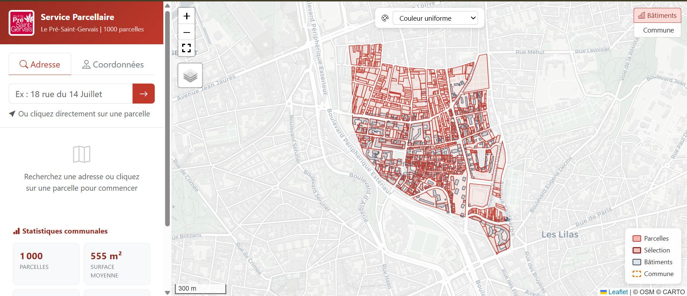

# 🗺️ Service Parcellaire — Le Pré-Saint-Gervais

> Application web de consultation parcellaire pour la commune du Pré-Saint-Gervais (93061), construite avec PostgreSQL/PostGIS et exposée via une API REST GeoJSON.


---

## 📋 Présentation

Ce projet implémente un **service web spatial de bout en bout** : de la donnée brute importée dans PostgreSQL/PostGIS jusqu'à une interface cartographique interactive interrogeable par adresse ou par clic sur la carte.

À partir d'une adresse postale ou d'une paire de coordonnées, le service retourne :

- La **parcelle cadastrale** correspondante (géométrie + identifiant)
- La **surface** en m²
- Le **nombre de bâtiments** présents sur la parcelle
- Le **ratio bâti / surface totale**
- La **pente moyenne** du terrain (via MNT RGE ALTI 5m)
- L'**historique des transactions immobilières** (DVF, 5 dernières années)



---

## 🏗️ Architecture

```
┌─────────────────┐     ┌──────────────────┐     ┌─────────────────┐
│   Frontend      │────▶│  pg_featureserv  │────▶│ PostgreSQL      │
│   Leaflet +     │ API │  (REST GeoJSON)  │ SQL │ + PostGIS       │
│   Bootstrap 5   │◀────│                  │◀────│                 │
└─────────────────┘     └──────────────────┘     └─────────────────┘
                                                   │
                                                   ├── parcelle (cadastre Etalab)
                                                   ├── batiment (BD TOPO)
                                                   ├── adresse_ban (BAN)
                                                   ├── dvf (DVF 2021-2025)
                                                   ├── mnt (RGE ALTI 5m)
                                                   ├── commune (Admin Express)
                                                   └── parcelle_stats (vue pré-calculée)
```

### Pipeline fonctionnel

```
Adresse textuelle ──▶ geocode_adresse() ──▶ Point géographique
                                                    │
Coordonnées (x,y) ─────────────────────────────────┘
                                                    ▼
                                          trouver_parcelle()
                                                    │
                                    ┌───────────────┼───────────────┐
                                    ▼               ▼               ▼
                            stats_batiments()  historique_dvf()  pente_moyenne()
                                    │               │               │
                                    └───────────────┼───────────────┘
                                                    ▼
                         service_parcellaire_xy() / service_parcellaire_adresse()
                                                    │
                                                    ▼
                                    pg_featureserv (API REST GeoJSON)
```

---

## ✨ Fonctionnalités

### Backend (PostgreSQL/PostGIS)
- **Géocodage interne** à partir de la BAN avec recherche multi-niveaux (exact, approximatif, mots-clés)
- **Recherche de parcelle** avec fallback spatial (`ST_Contains` → `ST_DWithin`)
- **Calcul de statistiques** bâtiments par intersection spatiale
- **Historique DVF** agrégé ou détaillé (paramètre booléen)
- **Pente moyenne** via PostGIS Raster (`ST_Slope` + `ST_SummaryStats`)
- **Gestion des cas limites** avec messages d'erreur explicites dans l'API

### Frontend (Leaflet + Bootstrap 5)
- 🗺️ Carte interactive avec **3 fonds de carte** (Plan, Satellite, OSM)
- 🔍 Recherche par **adresse** (avec autocomplétion) ou **coordonnées Lambert-93**
- 🖱️ **Clic sur parcelle** pour interrogation directe
- 🎨 Mode **choroplèthe** (4 métriques : surface, bâtiments, surface bâtie, ratio)
- 🏢 Couche **bâtiments** et **contour communal** activables
- 📊 **Dashboard communal** avec statistiques globales
- 📈 **Graphique DVF** en barres pour chaque parcelle
- 💬 **Tooltips** au survol avec stats pré-calculées
- 📱 **Responsive** (mobile/desktop)

---

## 📂 Structure du projet

```
service-parcellaire-lpsg/
├── frontend/
│   ├── index.html          # Structure HTML
│   ├── style.css           # Styles personnalisés
│   └── app.js              # Logique applicative
├── sql/
│   ├── 01_tables.sql       # Création des tables
│   ├── 02_functions.sql    # Fonctions PL/pgSQL
│   └── 03_grants.sql       # Droits d'accès
├── docs/
│   ├── rapport.qmd         # Rapport Quarto
│   └── captures/           # Captures d'écran
├── .gitignore
└── README.md
```

---

## 🚀 Installation

### Prérequis
- PostgreSQL 14+ avec PostGIS 3+
- pg_featureserv
- Python 3 (pour le serveur de développement)
- ogr2ogr (QGIS ou GDAL)

### 1. Base de données

```sql
-- Créer le schéma
CREATE SCHEMA IF NOT EXISTS mon_schema;

-- Exécuter les scripts SQL dans l'ordre
-- 01_tables.sql  → Création des tables
-- 02_functions.sql → Fonctions PL/pgSQL
-- 03_grants.sql → Droits pour pg_featureserv
```

### 2. Import des données

| Donnée | Source | Format |
|--------|--------|--------|
| Parcelles cadastrales | [cadastre.data.gouv.fr](https://cadastre.data.gouv.fr) | GeoJSON |
| BAN (adresses) | [adresse.data.gouv.fr](https://adresse.data.gouv.fr) | CSV |
| DVF (transactions) | [data.gouv.fr](https://files.data.gouv.fr/geo-dvf/) | CSV |
| Bâtiments | BD TOPO (IGN) | PostgreSQL |
| MNT | RGE ALTI 5m (IGN) | ASC |
| Communes | Admin Express (IGN) | PostgreSQL |

### 3. Frontend

```bash
cd frontend
python -m http.server 8080
# Ouvrir http://localhost:8080
```

---

## 🔗 API Endpoints

### Recherche par adresse
```
GET /featureserv/functions/{schema}.service_parcellaire_adresse/items?adresse=18%20rue%20du%2014%20juillet
```

### Recherche par coordonnées
```
GET /featureserv/functions/{schema}.service_parcellaire_xy/items?x=655957&y=6865609&srid=2154
```

### Réponse GeoJSON
```json
{
  "type": "FeatureCollection",
  "features": [{
    "type": "Feature",
    "geometry": { "type": "Polygon", "coordinates": [...] },
    "properties": {
      "id_parcelle": "930610000B0120",
      "surface_parcelle_m2": 603.72,
      "nb_batiments": 5,
      "ratio_bati": 0.6456,
      "pente_moyenne_deg": 1.37,
      "dvf_resume": "2024-11-25 | Vente | 80000€ | ...",
      "message": "OK"
    }
  }]
}
```

---

## 🛠️ Stack technique

| Composant | Technologie |
|-----------|-------------|
| Base de données | PostgreSQL 14 + PostGIS 3.x |
| Raster | PostGIS Raster (RGE ALTI 5m) |
| API REST | pg_featureserv |
| Cartographie | Leaflet 1.9 |
| UI | Bootstrap 5.3 + Bootstrap Icons |
| Géocodage | PL/pgSQL (BAN locale) |
| Données | Cadastre Etalab, BAN, DVF, BD TOPO, Admin Express |

---

## 📝 Contexte académique

Projet réalisé dans le cadre du cours **PostgreSQL/PostGIS** du Master G2M (Géomatique, Géodécisionnelle, Géomarketing et Multimédia) à l'**Université Paris 8**.

---

## 📄 Licence

Ce projet est à but éducatif. Les données utilisées sont des données ouvertes françaises (Licence Ouverte / Open Licence Etalab 2.0).
