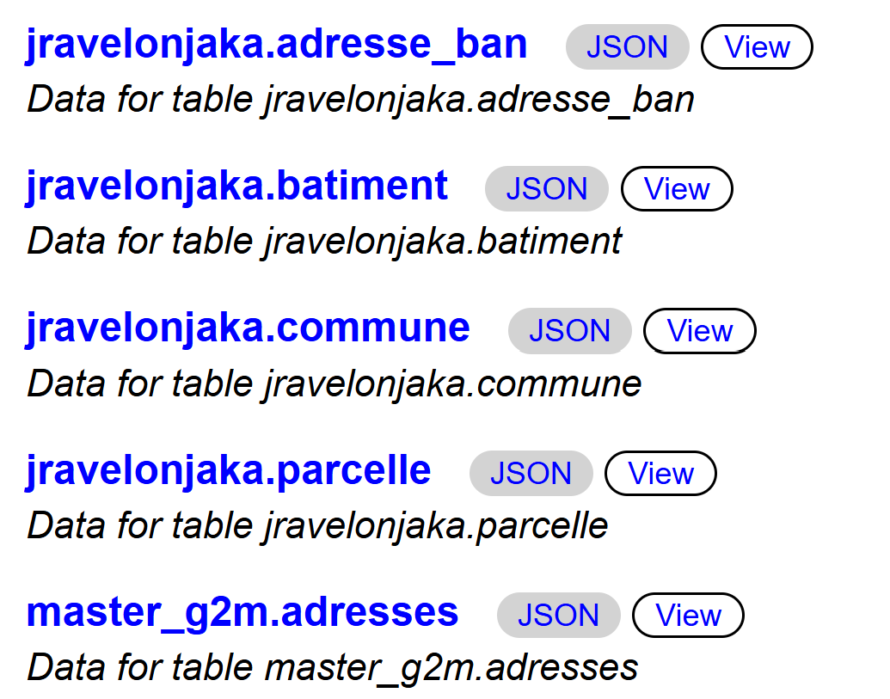
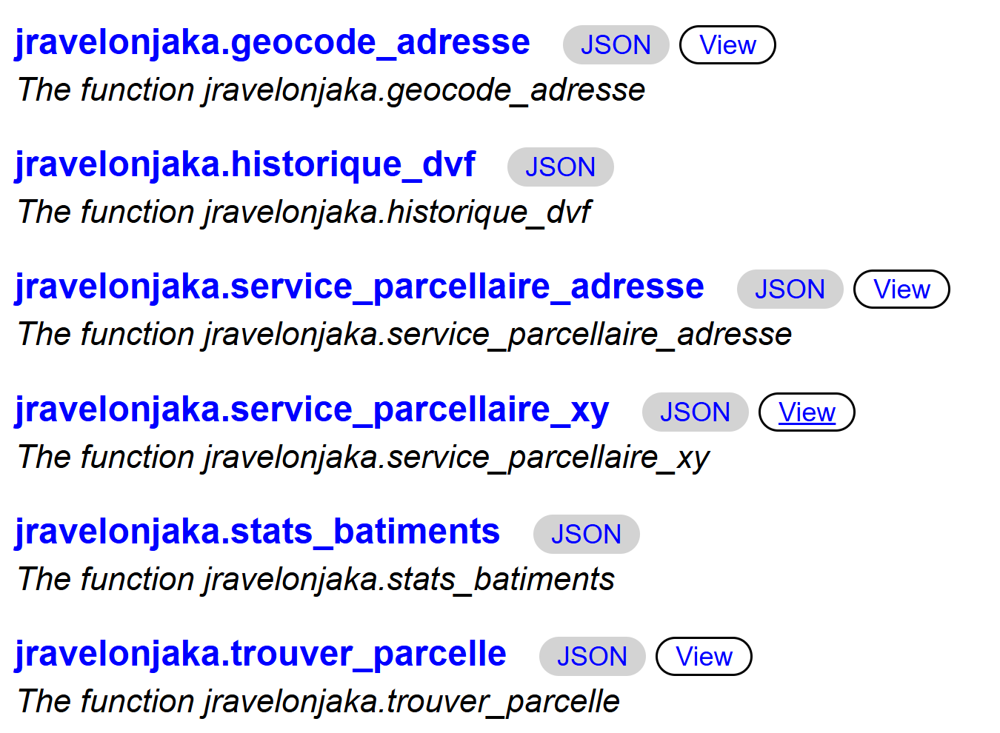
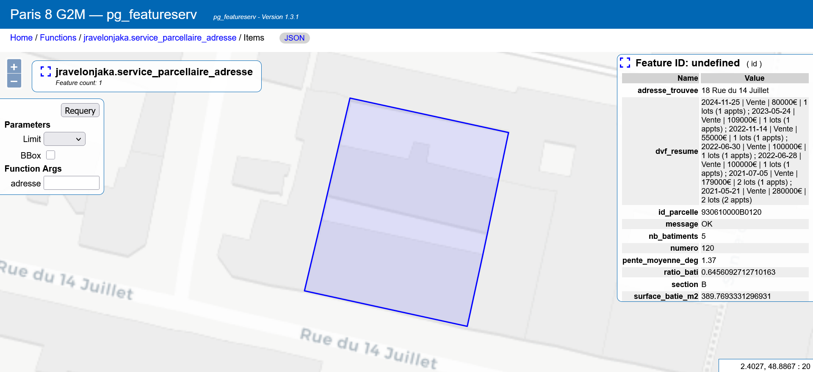

# Introduction

L'objectif de ce mini-projet est de construire un **service web spatial** pour la commune du Pré-Saint-Gervais (93310). Le principe est simple : à partir d'une adresse postale ou d'une paire de coordonnées, le service doit retourner la parcelle cadastrale correspondante accompagnée d'un ensemble de statistiques (surface, bâtiments, historique des transactions immobilières).

Le résultat final est une **API REST GeoJSON**, exposée via `pg_featureserv`, interrogeable par n'importe quel client HTTP.

Ce document retrace ma démarche complète : de l'exploration des données jusqu'à l'exposition de l'API, en passant par les choix techniques, les blocages rencontrés et les solutions adoptées.

## Architecture générale

Le pipeline que j'ai mis en place suit cette logique :


```{mermaid}
%%| fig-width: 8
%%| label: fig-pipeline
%%| fig-cap: "Pipeline du service parcellaire LPSG"
flowchart TD
    A["Adresse textuelle"] --> B["geocode_adresse()"]
    B --> C["Point géographique"]
    D["Coordonnées x, y"] --> C
    C --> E["trouver_parcelle()"]
    E --> F["Parcelle identifiée"]
    F --> G["stats_batiments()"]
    F --> H["historique_dvf()"]
    F --> I["pente_moyenne()"]
    G --> J["service_parcellaire_xy()"]
    H --> J
    I --> J
    A --> K["service_parcellaire_adresse()"]
    K --> J
    J --> L["pg_featureserv — API REST GeoJSON"]

    style A fill:#e8f0f7,stroke:#2c5f8a,stroke-width:2px
    style D fill:#e8f0f7,stroke:#2c5f8a,stroke-width:2px
    style L fill:#d4532b,stroke:#d4532b,color:#fff,stroke-width:2px
    style F fill:#fff3cd,stroke:#856404,stroke-width:2px
    style G fill:#d4edda,stroke:#155724
    style H fill:#d4edda,stroke:#155724
    style I fill:#d4edda,stroke:#155724
```

J'ai fait le choix de **découper le problème en fonctions indépendantes** plutôt que de tout mettre dans une seule grosse requête. Chaque fonction a une responsabilité unique, ce qui m'a permis de tester chaque étape séparément avant d'assembler le tout. C'est d'ailleurs un conseil de l'énoncé : "testez chaque étape indépendamment avant d'assembler".

::: {.callout-tip}
## Liens API
Les deux endpoints du service sont accessibles ici :

- **Par adresse** : [`https://chairegif.fr/featureserv/functions/jravelonjaka.service_parcellaire_adresse/items?adresse=...`](https://chairegif.fr/featureserv/functions/jravelonjaka.service_parcellaire_adresse/items?adresse=18%20rue%20du%2014%20juillet)
- **Par coordonnées** : [`https://chairegif.fr/featureserv/functions/jravelonjaka.service_parcellaire_xy/items?x=...&y=...`](https://chairegif.fr/featureserv/functions/jravelonjaka.service_parcellaire_xy/items?x=655957&y=6865609)
- **Viewer cartographique** : [`items.html?adresse=...`](https://chairegif.fr/featureserv/functions/jravelonjaka.service_parcellaire_adresse/items.html?adresse=18%20rue%20du%2014%20juillet)
:::


# 1. Exploration et préparation des données

## 1.1 Exploration de la base existante

Avant d'écrire la moindre ligne de code, j'ai commencé par explorer ce qui existait déjà sur le serveur pédagogique. La base `postgis_2526` contient plusieurs schémas, dont deux qui m'intéressent particulièrement : `bdtopo` et `admin_express`.

```sql
-- Lister les tables de la BD TOPO
\dt bdtopo.*

-- Lister les tables d'Admin Express
\dt admin_express.*

-- Vérifier les extensions disponibles
SELECT name FROM pg_available_extensions 
WHERE name IN ('postgis', 'postgis_raster', 'pg_net', 'http', 'plpython3u') 
ORDER BY name;
```

**Ce que j'ai trouvé :**

- `bdtopo.batiment` contient les bâtiments avec une géométrie `MultiPolygon` en EPSG:2154 (Lambert-93), déjà indexée spatialement — c'est exactement ce qu'il me faut pour calculer le nombre de bâtiments et la surface bâtie sur chaque parcelle.
- `admin_express.communes_francemetro` contient les communes avec leur géométrie, leur code INSEE et leur population. C'est ce qui me permet de filtrer toutes mes données sur Le Pré-Saint-Gervais.
- PostGIS et PostGIS Raster sont disponibles. `plpython3u` est listé mais je n'ai pas les droits pour l'activer (j'y reviens plus loin).

## 1.2 Création des tables locales

Ma première étape a été de créer dans mon schéma `jravelonjaka` les tables dont j'ai besoin, en filtrant les données existantes sur la commune du Pré-Saint-Gervais. L'idée est de ne pas travailler directement sur les schémas sources (qui sont partagés) et de ne garder que les données pertinentes.

### Table commune

```sql
CREATE TABLE jravelonjaka.commune AS
SELECT id, cleabs, nom_officiel, code_insee, population, 
       code_postal, superficie_cadastrale, geom
FROM admin_express.communes_francemetro
WHERE code_insee = '93061';

CREATE INDEX idx_commune_geom ON jravelonjaka.commune USING GIST (geom);
```

Je ne garde que les colonnes utiles. L'index spatial GIST sur la géométrie est indispensable : il sera utilisé plus tard pour vérifier rapidement si un point se trouve dans la commune (via `ST_Contains`).

### Table bâtiments

```sql
CREATE TABLE jravelonjaka.batiment AS
SELECT b.*
FROM bdtopo.batiment b
JOIN admin_express.communes_francemetro c 
  ON ST_Intersects(b.geom, c.geom)
WHERE c.code_insee = '93061';

ALTER TABLE jravelonjaka.batiment ADD PRIMARY KEY (cleabs);
CREATE INDEX idx_batiment_geom ON jravelonjaka.batiment USING GIST (geom);
```

Ici, j'utilise `ST_Intersects` plutôt que `ST_Contains` pour la jointure spatiale. La raison : un bâtiment situé en bordure de commune pourrait chevaucher la limite sans être entièrement contenu dedans. Avec `ST_Intersects`, je récupère aussi ces bâtiments frontaliers, ce qui est plus correct pour le calcul de surface bâtie.

J'ajoute une clé primaire sur `cleabs` (identifiant unique dans la BD TOPO) et un index spatial GIST — ce dernier est crucial car la fonction `stats_batiments` fera des requêtes spatiales intensives sur cette table.

**Vérification :**

```sql
SELECT 'commune' AS table_name, COUNT(*) FROM jravelonjaka.commune
UNION ALL
SELECT 'batiment', COUNT(*) FROM jravelonjaka.batiment;
```

| table_name | count |
|---|---|
| commune | 1 |
| batiment | 1 897 |

1 897 bâtiments pour une commune de 0,7 km² — c'est cohérent avec la densité urbaine du Pré-Saint-Gervais, l'une des communes les plus denses de France.


## 1.3 Import des données externes

Trois jeux de données ne sont pas disponibles sur le serveur et doivent être importés depuis des sources ouvertes :

- Les **parcelles cadastrales** (cadastre Etalab) — c'est le cœur du service
- La **BAN** (Base Adresse Nationale) — pour le géocodage adresse → coordonnées
- Les **DVF** (Demandes de Valeurs Foncières) — pour l'historique des transactions

### 1.3a — Parcelles cadastrales

Les parcelles sont disponibles sur le site d'Etalab, au format GeoJSON, découpées par commune. J'ai téléchargé le fichier pour la commune 93061 :

```powershell
# Téléchargement depuis PowerShell
Invoke-WebRequest -Uri "https://files.data.gouv.fr/cadastre/etalab-cadastre/2026-03-01/geojson/communes/93/93061/cadastre-93061-parcelles.json.gz" -OutFile "cadastre-93061-parcelles.json.gz"
```

Pour l'import dans PostgreSQL, j'ai utilisé `ogr2ogr` via le shell OSGeo4W (fourni avec QGIS) :

```bash
ogr2ogr -f "PostgreSQL" \
  "PG:host=185.98.128.232 port=... dbname=postgis_2526 user=jravelonjaka password=..." \
  "cadastre-93061-parcelles.json" \
  -nln jravelonjaka.parcelle \
  -lco GEOMETRY_NAME=geom \
  -lco FID=gid \
  -t_srs EPSG:2154 \
  -overwrite
```

**Points importants :**

- `-t_srs EPSG:2154` : je reprojette les données en Lambert-93 pour être cohérent avec les bâtiments de la BD TOPO. Les calculs de surface et de distance doivent être faits dans un système projeté métrique.
- `-lco GEOMETRY_NAME=geom` : je nomme la colonne géométrie `geom` par convention.

::: {.callout-warning}
## Difficulté — conflit de versions PROJ
Lors de ma première tentative d'import via PowerShell, j'ai eu une erreur `PROJ: proj_create_from_database ... contains DATABASE.LAYOUT.VERSION.MINOR = 2 whereas a number >= 6 is expected`. C'est un conflit entre la version PROJ de QGIS et celle de PostgreSQL installé localement. La solution a été d'utiliser le **shell OSGeo4W** au lieu de PowerShell, car il a son propre environnement PROJ isolé.
:::

**Résultat : 1 032 parcelles** importées, avec un index spatial créé automatiquement par ogr2ogr.

### 1.3b — Base Adresse Nationale (BAN)

La BAN est le référentiel national des adresses. Je l'utilise pour le géocodage (transformer une adresse textuelle en point géographique). Le fichier CSV pour le département 93 est disponible sur :

`https://adresse.data.gouv.fr/data/ban/adresses/latest/csv/adresses-93.csv.gz`

J'ai d'abord inspecté la structure du fichier avec `Get-Content` pour connaître les colonnes, puis j'ai créé la table correspondante et importé via `\copy` :

```sql
CREATE TABLE jravelonjaka.adresse_ban (
    id TEXT,
    id_fantoir TEXT,
    numero INTEGER,
    rep TEXT,
    nom_voie TEXT,
    code_postal TEXT,
    code_insee TEXT,
    nom_commune TEXT,
    code_insee_ancienne_commune TEXT,
    nom_ancienne_commune TEXT,
    x DOUBLE PRECISION,
    y DOUBLE PRECISION,
    lon DOUBLE PRECISION,
    lat DOUBLE PRECISION,
    type_position TEXT,
    alias TEXT,
    nom_ld TEXT,
    libelle_acheminement TEXT,
    nom_afnor TEXT,
    source_position TEXT,
    source_nom_voie TEXT,
    certification_commune INTEGER,
    cad_parcelles TEXT
);

\copy jravelonjaka.adresse_ban FROM 'adresses-93.csv' 
  WITH (FORMAT csv, HEADER true, DELIMITER ';', ENCODING 'UTF8');
```

Ensuite, j'ai filtré pour ne garder que les adresses du Pré-Saint-Gervais et j'ai construit la colonne géométrie :

```sql
-- Ne garder que notre commune
DELETE FROM jravelonjaka.adresse_ban WHERE code_insee != '93061';

-- Construire la géométrie à partir des coordonnées x,y (déjà en Lambert-93)
ALTER TABLE jravelonjaka.adresse_ban ADD COLUMN geom geometry(Point, 2154);
UPDATE jravelonjaka.adresse_ban SET geom = ST_SetSRID(ST_MakePoint(x, y), 2154);

CREATE INDEX idx_adresse_ban_geom ON jravelonjaka.adresse_ban USING GIST (geom);
```

Un point important : les colonnes `x` et `y` de la BAN sont déjà en Lambert-93 (EPSG:2154), ce qui simplifie les choses. Les colonnes `lon` et `lat` sont en WGS84, mais je n'en ai pas besoin puisque tout mon système travaille en Lambert-93.

**Résultat : 1 377 adresses** pour Le Pré-Saint-Gervais, couvrant **80 voies distinctes**.

### 1.3c — DVF (Demandes de Valeurs Foncières)

Les données DVF sont les transactions immobilières rendues publiques par la DGFiP. J'ai téléchargé les fichiers géolocalisés pour les 5 dernières années (2021 à 2025), déjà filtrés par commune sur data.gouv.fr :

```
https://files.data.gouv.fr/geo-dvf/latest/csv/2021/communes/93/93061.csv
https://files.data.gouv.fr/geo-dvf/latest/csv/2022/communes/93/93061.csv
https://files.data.gouv.fr/geo-dvf/latest/csv/2023/communes/93/93061.csv
https://files.data.gouv.fr/geo-dvf/latest/csv/2024/communes/93/93061.csv
https://files.data.gouv.fr/geo-dvf/latest/csv/2025/communes/93/93061.csv
```

Après avoir créé la table avec la bonne structure (inspectée via `Get-Content` sur le premier fichier), j'ai importé les 5 fichiers à la suite :

```sql
\copy jravelonjaka.dvf FROM 'dvf_2021_93061.csv' WITH (FORMAT csv, HEADER true, DELIMITER ',', ENCODING 'UTF8');
\copy jravelonjaka.dvf FROM 'dvf_2022_93061.csv' WITH (FORMAT csv, HEADER true, DELIMITER ',', ENCODING 'UTF8');
\copy jravelonjaka.dvf FROM 'dvf_2023_93061.csv' WITH (FORMAT csv, HEADER true, DELIMITER ',', ENCODING 'UTF8');
\copy jravelonjaka.dvf FROM 'dvf_2024_93061.csv' WITH (FORMAT csv, HEADER true, DELIMITER ',', ENCODING 'UTF8');
\copy jravelonjaka.dvf FROM 'dvf_2025_93061.csv' WITH (FORMAT csv, HEADER true, DELIMITER ',', ENCODING 'UTF8');

-- Index sur id_parcelle : c'est la colonne de jointure avec les parcelles cadastrales
CREATE INDEX idx_dvf_id_parcelle ON jravelonjaka.dvf (id_parcelle);
```

L'index B-tree sur `id_parcelle` est essentiel : la fonction `historique_dvf` fera des recherches fréquentes par identifiant parcellaire. Sans cet index, chaque appel scannerait les 3 023 lignes.

**Résultat : 3 023 mutations** couvrant la période du 6 janvier 2021 au 29 décembre 2025.

### 1.3d — MNT (Modèle Numérique de Terrain) — Bonus pente

Pour calculer la pente moyenne de chaque parcelle, j'ai importé le **RGE ALTI 5m** de l'IGN (données gratuites en téléchargement libre). Le RGE ALTI est livré par département au format ASC (grille raster), découpé en dalles de 5 km × 5 km.

J'ai téléchargé l'archive du département 93 puis identifié les deux dalles couvrant l'emprise de la commune (X: 655926-656871, Y: 6864429-6865681) :

- `RGEALTI_FXX_0655_6865_MNT_LAMB93_IGN69.asc` — couvre X: 655000-660000, Y: 6860000-6865000
- `RGEALTI_FXX_0655_6870_MNT_LAMB93_IGN69.asc` — couvre X: 655000-660000, Y: 6865000-6870000

J'ai vérifié l'emprise de chaque dalle en lisant les en-têtes des fichiers ASC (les 6 premières lignes contiennent `ncols`, `nrows`, `xllcorner`, `yllcorner`, `cellsize`, `NODATA_value`). C'est important de ne charger que les dalles nécessaires — l'énoncé prévoit une pénalité de -5 points en cas d'import surdimensionné.

L'import dans PostGIS est réalisé avec `raster2pgsql` :

```powershell
raster2pgsql -s 2154 -t 100x100 -I -C -M `
  "RGEALTI_FXX_0655_6865_MNT_LAMB93_IGN69.asc" `
  "RGEALTI_FXX_0655_6870_MNT_LAMB93_IGN69.asc" `
  jravelonjaka.mnt | psql -h ... -d postgis_2526 -U jravelonjaka
```

Les options utilisées :

- `-s 2154` : le raster est en Lambert-93
- `-t 100x100` : découpe chaque dalle en tuiles de 100×100 pixels. Sans ce découpage, PostgreSQL devrait charger la dalle entière (1000×1000 pixels) pour chaque requête, même si on ne cherche que la pente d'une petite parcelle. Le tuilage permet à l'index spatial de ne charger que les tuiles pertinentes.
- `-I` : crée un index spatial GIST sur les tuiles
- `-C` : ajoute les contraintes raster (SRID, résolution, type de pixel)
- `-M` : lance `VACUUM ANALYZE` après l'import pour optimiser les statistiques de la table

**Résultat : 200 tuiles** importées, couvrant l'emprise nécessaire.

## 1.4 Récapitulatif des données

| Table | Lignes | Source | Géométrie |
|---|---|---|---|
| commune | 1 | admin_express | MultiPolygon, 2154 |
| batiment | 1 897 | bdtopo | MultiPolygon, 2154 |
| parcelle | 1 032 | cadastre Etalab | Polygon, 2154 |
| adresse_ban | 1 377 | BAN | Point, 2154 |
| dvf | 3 023 | data.gouv.fr | — (attributaire) |
| mnt | 200 tuiles | RGE ALTI 5m (IGN) | Raster, 2154 |

Toutes les géométries sont en **EPSG:2154 (Lambert-93)**, ce qui permet des calculs métriques cohérents (surfaces en m², distances en mètres).


# 2. Géocodage interne

Le géocodage est l'opération qui transforme une adresse textuelle ("18 rue du 14 Juillet") en un point géographique. C'est la première étape du pipeline quand l'utilisateur interroge le service par adresse.

## 2.1 Choix de la méthode

J'avais initialement deux options :

1. **Appeler l'API adresse.data.gouv.fr** directement depuis PostgreSQL via `plpython3u` — c'est la solution la plus robuste (gestion des fautes de frappe, autocomplétion, etc.)
2. **Faire un géocodage interne** en cherchant dans la table BAN importée localement

J'ai dû opter pour la **solution 2** car je n'ai pas les droits pour activer `plpython3u` sur le serveur. Mais pour ce projet la BAN locale suffit amplement : Le Pré-Saint-Gervais ne compte que 80 voies, ce qui rend la correspondance textuelle très fiable.

## 2.2 Exploration préalable des données BAN

Avant de coder la fonction, j'ai regardé comment les adresses sont structurées dans la BAN :

```sql
SELECT numero, rep, nom_voie, nom_afnor 
FROM jravelonjaka.adresse_ban LIMIT 10;

SELECT COUNT(DISTINCT nom_voie) FROM jravelonjaka.adresse_ban;
-- Résultat : 80 voies distinctes
```

La colonne `nom_afnor` contient le nom de voie en majuscules sans accents (ex: "RUE DES 7 ARPENTS"), ce qui est idéal pour la comparaison textuelle.

J'ai aussi vérifié si l'extension `pg_trgm` était disponible — elle permet la recherche par similarité textuelle (tolérance aux fautes de frappe). L'extension existe sur le serveur mais je n'ai pas les droits pour l'activer. J'ai donc implémenté un géocodage basé sur `ILIKE` avec une normalisation manuelle.

## 2.3 La fonction geocode_adresse

La logique de la fonction est la suivante :

1. **Extraction** : on sépare le numéro de rue du nom de voie dans la chaîne saisie
2. **Normalisation** : on met en majuscules et on retire les accents courants
3. **Recherche en 3 niveaux** avec des fallbacks progressifs

```sql
CREATE OR REPLACE FUNCTION jravelonjaka.geocode_adresse(adresse_input TEXT)
RETURNS TABLE (
    adresse_trouvee TEXT,
    geom geometry(Point, 2154)
) AS $$
DECLARE
    v_numero INTEGER;
    v_voie TEXT;
BEGIN
    -- Extraction : "12 rue Baudin" → v_numero=12, v_voie="rue Baudin"
    v_numero := (regexp_match(trim(adresse_input), '^\s*(\d+)'))[1]::INTEGER;
    v_voie := trim(regexp_replace(trim(adresse_input), '^\s*\d+\s*', ''));
    
    -- Normalisation pour comparer avec nom_afnor (majuscules, sans accents)
    v_voie := upper(v_voie);
    v_voie := replace(replace(replace(replace(replace(v_voie, 
        'É','E'), 'È','E'), 'Ê','E'), 'À','A'), 'Ô','O');

    -- Niveau 1 : correspondance exacte numéro + voie
    RETURN QUERY
    SELECT concat(a.numero, ' ', a.nom_voie)::TEXT, a.geom
    FROM jravelonjaka.adresse_ban a
    WHERE a.numero = v_numero
      AND a.nom_afnor ILIKE '%' || v_voie || '%'
    LIMIT 1;

    -- Niveau 2 : voie trouvée mais pas le numéro exact → numéro le plus proche
    IF NOT FOUND THEN
        RETURN QUERY
        SELECT concat(a.numero, ' ', a.nom_voie)::TEXT, a.geom
        FROM jravelonjaka.adresse_ban a
        WHERE a.nom_afnor ILIKE '%' || v_voie || '%'
        ORDER BY abs(a.numero - coalesce(v_numero, a.numero)) ASC
        LIMIT 1;
    END IF;

    -- Niveau 3 : recherche par mots-clés (chaque mot doit apparaître)
    IF NOT FOUND THEN
        RETURN QUERY
        SELECT concat(a.numero, ' ', a.nom_voie)::TEXT, a.geom
        FROM jravelonjaka.adresse_ban a
        WHERE a.nom_afnor ILIKE ALL (
            SELECT '%' || unnest(string_to_array(v_voie, ' ')) || '%'
        )
        ORDER BY abs(a.numero - coalesce(v_numero, a.numero)) ASC
        LIMIT 1;
    END IF;
END;
$$ LANGUAGE plpgsql STABLE;
```

**Pourquoi `STABLE` ?** Le mot-clé `STABLE` indique à PostgreSQL que la fonction retourne toujours le même résultat pour les mêmes arguments au sein d'une même transaction. C'est le cas ici car on ne fait que lire des données. Ça permet à l'optimiseur de requêtes de mettre en cache les résultats.

**Pourquoi 3 niveaux de recherche ?** Le fallback progressif gère plusieurs cas réels :

- Niveau 1 : "12 rue Baudin" → correspondance parfaite
- Niveau 2 : "13 rue Baudin" → le numéro 13 n'existe pas, on prend le plus proche
- Niveau 3 : "rue du 14 Juillet" → la voie contient des mots dans un ordre différent

::: {.callout-note}
## Limite identifiée
La fonction ne tolère pas les fautes de frappe ("ru bodin" au lieu de "rue Baudin"). L'extension `pg_trgm` avec sa fonction `similarity()` résoudrait ce problème, mais je n'ai pas les droits pour l'activer. C'est une amélioration possible si le prof l'active.
:::

**Tests :**

```sql
SELECT * FROM jravelonjaka.geocode_adresse('12 rue Baudin');
-- ✓ Retourne "12 Rue Baudin"

SELECT * FROM jravelonjaka.geocode_adresse('5 grande avenue');
-- ✓ Retourne "5 Grande Avenue"

SELECT * FROM jravelonjaka.geocode_adresse('28 rue des 7 arpents');
-- ✓ Retourne "28 Rue des 7 Arpents"
```


# 3. Recherche de parcelle

Une fois le point géographique obtenu (via géocodage ou coordonnées directes), il faut trouver la parcelle cadastrale correspondante.

## 3.1 Logique de recherche

La fonction gère deux cas :

1. **Cas nominal** : le point tombe à l'intérieur d'une parcelle → `ST_Contains`
2. **Cas limite** : le point tombe sur une route, un trottoir, ou juste en bordure de parcelle → fallback avec `ST_DWithin` (rayon de 50 mètres) + `ST_Distance` pour prendre la parcelle la plus proche

Ce deuxième cas est fréquent en pratique : les points adresse de la BAN sont souvent positionnés au niveau de l'entrée du bâtiment ou sur la voie, pas au centre de la parcelle.

```sql
CREATE OR REPLACE FUNCTION jravelonjaka.trouver_parcelle(point_input geometry(Point, 2154))
RETURNS TABLE (
    gid INTEGER,
    id_parcelle TEXT,
    section TEXT,
    numero TEXT,
    contenance INTEGER,
    surface_m2 DOUBLE PRECISION,
    geom geometry
) AS $$
BEGIN
    -- Cas 1 : le point est à l'intérieur d'une parcelle
    RETURN QUERY
    SELECT p.gid, p.id::TEXT, p.section::TEXT, p.numero::TEXT,
           p.contenance, ST_Area(p.geom), p.geom
    FROM jravelonjaka.parcelle p
    WHERE ST_Contains(p.geom, point_input)
    LIMIT 1;

    -- Cas 2 : fallback — parcelle la plus proche dans un rayon de 50m
    IF NOT FOUND THEN
        RETURN QUERY
        SELECT p.gid, p.id::TEXT, p.section::TEXT, p.numero::TEXT,
               p.contenance, ST_Area(p.geom), p.geom
        FROM jravelonjaka.parcelle p
        WHERE ST_DWithin(p.geom, point_input, 50)
        ORDER BY ST_Distance(p.geom, point_input) ASC
        LIMIT 1;
    END IF;
END;
$$ LANGUAGE plpgsql STABLE;
```

**Pourquoi `ST_DWithin` plutôt que juste `ORDER BY ST_Distance` ?** `ST_DWithin` utilise l'index spatial pour ne considérer que les parcelles dans un rayon de 50 mètres, ce qui est beaucoup plus performant que de calculer la distance à toutes les 1 032 parcelles. C'est une bonne pratique systématique pour les requêtes spatiales de type "plus proche voisin".

**Pourquoi `ST_Area(p.geom)` plutôt que `p.contenance` ?** La colonne `contenance` du cadastre est la surface fiscale (arrondie, parfois approximative). `ST_Area` calcule la surface géométrique réelle à partir du polygone, ce qui est plus précis pour nos calculs de ratio.

**Test chaîné (adresse → point → parcelle) :**

```sql
SELECT tp.*
FROM jravelonjaka.geocode_adresse('12 rue Baudin') ga,
     LATERAL jravelonjaka.trouver_parcelle(ga.geom) tp;
```

Le mot-clé `LATERAL` permet à la sous-requête `trouver_parcelle` d'accéder aux colonnes de `geocode_adresse`. C'est l'équivalent SQL d'un "pipe" : le résultat de la première fonction alimente la seconde.


# 4. Calcul des statistiques

## 4.1 Statistiques bâtiments

Cette fonction prend la géométrie d'une parcelle et retourne le nombre de bâtiments qui s'y trouvent, la surface bâtie totale et le ratio d'emprise au sol.

```sql
CREATE OR REPLACE FUNCTION jravelonjaka.stats_batiments(p_geom geometry)
RETURNS TABLE (
    nb_batiments INTEGER,
    surface_batie_m2 DOUBLE PRECISION,
    ratio_bati DOUBLE PRECISION
) AS $$
BEGIN
    RETURN QUERY
    SELECT
        COUNT(b.cleabs)::INTEGER,
        COALESCE(SUM(ST_Area(ST_Intersection(b.geom, p_geom))), 0),
        CASE 
            WHEN ST_Area(p_geom) > 0 
            THEN COALESCE(SUM(ST_Area(ST_Intersection(b.geom, p_geom))), 0) / ST_Area(p_geom)
            ELSE 0
        END
    FROM jravelonjaka.batiment b
    WHERE ST_Intersects(b.geom, p_geom);
END;
$$ LANGUAGE plpgsql STABLE;
```

**Pourquoi `ST_Intersection` pour la surface et pas juste `ST_Area(b.geom)` ?** Un bâtiment peut chevaucher plusieurs parcelles. Si je prenais la surface totale du bâtiment, je compterais la partie qui déborde sur la parcelle voisine. `ST_Intersection` découpe le bâtiment aux limites de la parcelle et ne mesure que la partie réellement sur la parcelle. C'est plus juste.

**Pourquoi `COALESCE(..., 0)` ?** Si aucun bâtiment n'intersecte la parcelle (terrain vague, jardin), `SUM` retourne `NULL`. `COALESCE` transforme ce `NULL` en `0`, ce qui est plus propre pour l'utilisateur.

**Le `CASE WHEN` sur le ratio** protège contre une division par zéro dans le cas théorique d'une parcelle de surface nulle.

::: {.callout-warning}
## Difficulté — conflit de noms de paramètres
Ma première version utilisait `parcelle_geom` comme nom de paramètre. PostgreSQL l'interprétait comme un nom de colonne dans la clause `WHERE`, ce qui donnait une erreur `l'argument de WHERE doit être de type boolean, et non du type geometry`. J'ai résolu le problème en renommant le paramètre en `p_geom`.
:::


## 4.2 Historique DVF

### Le problème du DVF brut

En testant une première version simple de la fonction DVF, je me suis retrouvé avec 519 lignes pour une seule parcelle. Le problème : dans le DVF, une mutation (une vente) qui concerne un immeuble entier génère **une ligne par lot** — chaque appartement, chaque cave, chaque parking est une ligne séparée, toutes avec la même valeur foncière.

C'est du bruit pour l'utilisateur final, qui veut juste savoir "il y a eu une vente à 6 133 000€ le 20/12/2024, concernant 174 appartements".

### La solution : agrégation par mutation

J'ai créé la fonction avec un paramètre `agrege` (booléen, `TRUE` par défaut) qui permet de choisir entre la vue synthétique et la vue détaillée :

```sql
CREATE OR REPLACE FUNCTION jravelonjaka.historique_dvf(
    parcelle_id TEXT, 
    agrege BOOLEAN DEFAULT TRUE
)
RETURNS TABLE (
    date_mutation DATE,
    nature_mutation TEXT,
    valeur_fonciere DOUBLE PRECISION,
    type_local TEXT,
    nb_lots INTEGER,
    nb_appartements INTEGER,
    surface_reelle_bati INTEGER
) AS $$
BEGIN
    IF agrege THEN
        -- Vue synthétique : une ligne par mutation
        RETURN QUERY
        SELECT d.date_mutation, d.nature_mutation::TEXT, d.valeur_fonciere,
               NULL::TEXT,
               COUNT(*)::INTEGER,
               COUNT(*) FILTER (WHERE d.type_local = 'Appartement')::INTEGER,
               COALESCE(SUM(d.surface_reelle_bati), 0)::INTEGER
        FROM jravelonjaka.dvf d
        WHERE d.id_parcelle = parcelle_id
        GROUP BY d.date_mutation, d.nature_mutation, d.valeur_fonciere
        ORDER BY d.date_mutation DESC;
    ELSE
        -- Vue détaillée : une ligne par lot
        RETURN QUERY
        SELECT d.date_mutation, d.nature_mutation::TEXT, d.valeur_fonciere,
               d.type_local::TEXT,
               1::INTEGER,
               CASE WHEN d.type_local = 'Appartement' THEN 1 ELSE 0 END::INTEGER,
               COALESCE(d.surface_reelle_bati, 0)::INTEGER
        FROM jravelonjaka.dvf d
        WHERE d.id_parcelle = parcelle_id
        ORDER BY d.date_mutation DESC;
    END IF;
END;
$$ LANGUAGE plpgsql STABLE;
```

**`COUNT(*) FILTER (WHERE ...)`** est une syntaxe PostgreSQL très pratique : elle permet de compter conditionnellement sans avoir à faire un `CASE WHEN ... THEN 1 END` dans un `SUM`. Ici, ça me donne directement le nombre d'appartements dans la mutation.

**Note sur l'exploitation du mode détaillé :** dans la version actuelle, la fonction principale (`service_parcellaire_xy`) appelle toujours `historique_dvf` en mode agrégé pour le champ `dvf_resume`. Le mode détaillé reste accessible directement via un appel à la fonction `historique_dvf`, par exemple pour un usage plus avancé. C'est un choix d'architecture : la vue synthétique dans l'API principale, le détail disponible à la demande.


## 4.3 Pente moyenne (bonus)

Cette fonction utilise les données raster du MNT pour calculer la pente moyenne d'une parcelle en degrés. Le calcul enchaîne trois opérations PostGIS Raster :

1. `ST_Slope` : calcule la pente en chaque pixel du MNT (en degrés)
2. `ST_Clip` : découpe le raster de pente aux contours de la parcelle
3. `ST_SummaryStats` : extrait la moyenne des valeurs de pente dans la zone découpée

```sql
CREATE OR REPLACE FUNCTION jravelonjaka.pente_moyenne(p_geom geometry)
RETURNS DOUBLE PRECISION AS $$
DECLARE
    v_pente DOUBLE PRECISION;
BEGIN
    SELECT AVG((ST_SummaryStats(
        ST_Clip(ST_Slope(rast, 1, '32BF', 'DEGREES'), p_geom), 1
    )).mean)
    INTO v_pente
    FROM jravelonjaka.mnt
    WHERE ST_Intersects(rast, p_geom);
    
    RETURN COALESCE(ROUND(v_pente::numeric, 2), 0);
END;
$$ LANGUAGE plpgsql STABLE;
```

**Pourquoi `AVG` autour de `ST_SummaryStats` ?** Une parcelle peut chevaucher plusieurs tuiles raster. Dans ce cas, `ST_Intersects` retourne plusieurs lignes (une par tuile). Chaque tuile donne sa propre moyenne de pente via `ST_SummaryStats(...).mean`. Le `AVG` fait la moyenne de ces moyennes partielles.

**Pourquoi `'32BF'` dans `ST_Slope` ?** C'est le type de pixel de sortie : un flottant 32 bits. C'est suffisant pour des valeurs de pente et plus léger qu'un 64 bits.

**Test :**

```sql
SELECT jravelonjaka.pente_moyenne(geom) FROM jravelonjaka.parcelle LIMIT 1;
-- Résultat : 2.32 degrés
```

Une pente de 2,32° est réaliste pour une commune urbaine relativement plate comme Le Pré-Saint-Gervais.


# 5. Fonctions principales

## 5.1 Point d'entrée par coordonnées

C'est la fonction centrale du service. Elle prend des coordonnées (x, y) et un SRID optionnel (Lambert-93 par défaut), et retourne toutes les informations sur la parcelle correspondante.

```sql
CREATE OR REPLACE FUNCTION jravelonjaka.service_parcellaire_xy(
    x DOUBLE PRECISION,
    y DOUBLE PRECISION,
    srid INTEGER DEFAULT 2154
)
RETURNS TABLE (
    id_parcelle TEXT,
    section TEXT,
    numero TEXT,
    surface_parcelle_m2 DOUBLE PRECISION,
    nb_batiments INTEGER,
    surface_batie_m2 DOUBLE PRECISION,
    ratio_bati DOUBLE PRECISION,
    pente_moyenne_deg DOUBLE PRECISION,
    dvf_resume TEXT,
    message TEXT,
    geom geometry
) AS $$
DECLARE
    v_point geometry;
    v_dans_commune BOOLEAN;
BEGIN
    -- Construire le point et reprojeter en L93 si nécessaire
    v_point := ST_Transform(ST_SetSRID(ST_MakePoint(x, y), srid), 2154);

    -- Vérifier si le point est dans la commune
    SELECT EXISTS(
        SELECT 1 FROM jravelonjaka.commune c
        WHERE ST_Contains(c.geom, v_point)
    ) INTO v_dans_commune;

    IF NOT v_dans_commune THEN
        RETURN QUERY SELECT
            NULL::TEXT, NULL::TEXT, NULL::TEXT, NULL::DOUBLE PRECISION,
            NULL::INTEGER, NULL::DOUBLE PRECISION, NULL::DOUBLE PRECISION,
            NULL::DOUBLE PRECISION, NULL::TEXT,
            'Le point fourni est en dehors de la commune du Pré-Saint-Gervais.'::TEXT,
            NULL::geometry;
        RETURN;
    END IF;

    RETURN QUERY
    SELECT
        tp.id_parcelle, tp.section, tp.numero, tp.surface_m2,
        sb.nb_batiments, sb.surface_batie_m2, sb.ratio_bati,
        jravelonjaka.pente_moyenne(tp.geom),
        (
            SELECT string_agg(
                dv.date_mutation::TEXT || ' | ' || dv.nature_mutation || ' | ' ||
                COALESCE(dv.valeur_fonciere::TEXT, 'N/A') || '€ | ' ||
                dv.nb_lots || ' lots (' || dv.nb_appartements || ' appts)',
                ' ; '
            )
            FROM jravelonjaka.historique_dvf(tp.id_parcelle, TRUE) dv
        ),
        'OK'::TEXT,
        ST_Transform(tp.geom, 4326)  -- Reprojection en WGS84 pour pg_featureserv
    FROM jravelonjaka.trouver_parcelle(v_point) tp,
         LATERAL jravelonjaka.stats_batiments(tp.geom) sb;

    IF NOT FOUND THEN
        RETURN QUERY SELECT
            NULL::TEXT, NULL::TEXT, NULL::TEXT, NULL::DOUBLE PRECISION,
            NULL::INTEGER, NULL::DOUBLE PRECISION, NULL::DOUBLE PRECISION,
            NULL::DOUBLE PRECISION, NULL::TEXT,
            'Aucune parcelle trouvée à proximité du point.'::TEXT,
            NULL::geometry;
    END IF;
END;
$$ LANGUAGE plpgsql STABLE;
```

::: {.callout-important}
## Points clés de la fonction principale

- **`ST_Transform(tp.geom, 4326)`** : le viewer HTML de pg_featureserv n'affiche que du WGS84. Les calculs internes (surfaces, distances) restent en Lambert-93, mais la géométrie retournée est reprojetée en WGS84 pour l'affichage.
- **Le champ `message`** : retourne "OK" en cas de succès, ou un message d'erreur explicite. C'est important car pg_featureserv ne transmet pas les `RAISE NOTICE` — sans ce champ, l'utilisateur recevrait un GeoJSON vide sans comprendre pourquoi.
- **Le paramètre `srid`** permet d'accepter des coordonnées dans d'autres systèmes (WGS84 par exemple) grâce à `ST_Transform`.
- **`string_agg`** concatène toutes les mutations en une seule chaîne de texte, séparées par " ; ". C'est un compromis pour retourner l'historique dans une seule ligne (contrainte de pg_featureserv qui attend une ligne par appel).
:::

## 5.2 Point d'entrée par adresse

Cette fonction est un wrapper autour de `service_parcellaire_xy` : elle ajoute l'étape de géocodage.

```sql
CREATE OR REPLACE FUNCTION jravelonjaka.service_parcellaire_adresse(
    adresse TEXT
)
RETURNS TABLE (
    adresse_trouvee TEXT,
    id_parcelle TEXT,
    section TEXT,
    numero TEXT,
    surface_parcelle_m2 DOUBLE PRECISION,
    nb_batiments INTEGER,
    surface_batie_m2 DOUBLE PRECISION,
    ratio_bati DOUBLE PRECISION,
    pente_moyenne_deg DOUBLE PRECISION,
    dvf_resume TEXT,
    message TEXT,
    geom geometry
) AS $$
DECLARE
    v_geom geometry;
    v_adresse TEXT;
BEGIN
    -- Étape 1 : géocodage
    SELECT ga.geom, ga.adresse_trouvee INTO v_geom, v_adresse
    FROM jravelonjaka.geocode_adresse(adresse) ga;

    IF v_geom IS NULL THEN
        RETURN QUERY SELECT
            NULL::TEXT, NULL::TEXT, NULL::TEXT, NULL::TEXT,
            NULL::DOUBLE PRECISION, NULL::INTEGER, NULL::DOUBLE PRECISION,
            NULL::DOUBLE PRECISION, NULL::DOUBLE PRECISION, NULL::TEXT,
            ('Adresse introuvable : "' || adresse || '". Essayez une adresse du Pré-Saint-Gervais.')::TEXT,
            NULL::geometry;
        RETURN;
    END IF;

    -- Étape 2 : appel au service principal
    RETURN QUERY
    SELECT v_adresse, sp.id_parcelle, sp.section, sp.numero,
           sp.surface_parcelle_m2, sp.nb_batiments, sp.surface_batie_m2,
           sp.ratio_bati, sp.pente_moyenne_deg, sp.dvf_resume, sp.message, sp.geom
    FROM jravelonjaka.service_parcellaire_xy(
        ST_X(v_geom), ST_Y(v_geom), 2154
    ) sp;
END;
$$ LANGUAGE plpgsql STABLE;
```

L'architecture à deux fonctions (`_adresse` et `_xy`) est un choix délibéré : la logique métier est centralisée dans `service_parcellaire_xy`, et `service_parcellaire_adresse` n'ajoute que le géocodage. Ça évite la duplication de code et ça donne deux endpoints distincts à l'utilisateur.

## 5.3 Test du pipeline complet
```sql
SELECT adresse_trouvee, id_parcelle, surface_parcelle_m2, 
       nb_batiments, ratio_bati, pente_moyenne_deg, dvf_resume, message
FROM jravelonjaka.service_parcellaire_adresse('18 rue du 14 juillet');
```

| adresse\_trouvee | id\_parcelle | surface\_parcelle\_m2 | nb\_batiments | ratio\_bati | pente\_moyenne\_deg | dvf\_resume | message |
| :--- | :--- | :--- | :--- | :--- | :--- | :--- | :--- |
| 18 Rue du 14 Juillet | 930610000B0120 | 603.7232587480521 | 5 | 0.6456092712710163 | 1.37 | 2024-11-25 \| Vente \| 80000€ \| 1 lots \(1 appts\) ; 2023-05-24 \| Vente \| 109000€ \| 1 lots \(1 appts\) ; 2022-11-14 \| Vente \| 55000€ \| 1 lots \(1 appts\) ; 2022-06-30 \| Vente \| 100000€ \| 1 lots \(1 appts\) ; 2022-06-28 \| Vente \| 100000€ \| 1 lots \(1 appts\) ; 2021-07-05 \| Vente \| 179000€ \| 2 lots \(1 appts\) ; 2021-05-21 \| Vente \| 280000€ \| 2 lots \(2 appts\) | OK |


# 6. Exposition via pg_featureserv

## 6.1 Droits d'accès

`pg_featureserv` se connecte à la base avec le rôle `read_only`. Par défaut, ce rôle n'a pas accès à mon schéma. J'ai accordé les droits nécessaires :

```sql
GRANT USAGE ON SCHEMA jravelonjaka TO read_only;
GRANT SELECT ON ALL TABLES IN SCHEMA jravelonjaka TO read_only;
GRANT EXECUTE ON ALL FUNCTIONS IN SCHEMA jravelonjaka TO read_only;
```

Vérification :

```sql
SELECT has_schema_privilege('read_only', 'jravelonjaka', 'USAGE');
-- Retourne : true
```

## 6.2 Test de l'API

Les fonctions et tables apparaissent dans l'interface de pg_featureserv :

- **Collections** (tables) : `https://chairegif.fr/featureserv/collections.html`


- **Fonctions** : `https://chairegif.fr/featureserv/functions.html`


### Test par adresse — cas normal

```bash
https://chairegif.fr/featureserv/functions/jravelonjaka.service_parcellaire_adresse/items?adresse=18%20rue%20du%2014%20juillet
```

Réponse GeoJSON :

```json
{
  "type": "FeatureCollection",
  "features": [
    {
      "type": "Feature",
      "geometry": {
        "type": "Polygon",
        "coordinates": [
          [
            [2.4025706, 48.8867957],
            [2.402276, 48.8868377],
            [2.4022556, 48.8867808],
            [2.4022337, 48.886719],
            [2.4022231, 48.8866892],
            [2.4021917, 48.886602],
            [2.4024937, 48.8865586],
            [2.4025224, 48.8866456],
            [2.4025314, 48.8866722],
            [2.4025522, 48.8867376],
            [2.4025706, 48.8867957]
          ]
        ]
      },
      "properties": {
        "adresse_trouvee": "18 Rue du 14 Juillet",
        "dvf_resume": "2024-11-25 | Vente | 80000€ | 1 lots (1 appts) ; 2023-05-24 | Vente | 109000€ | 1 lots (1 appts) ; 2022-11-14 | Vente | 55000€ | 1 lots (1 appts) ; 2022-06-30 | Vente | 100000€ | 1 lots (1 appts) ; 2022-06-28 | Vente | 100000€ | 1 lots (1 appts) ; 2021-07-05 | Vente | 179000€ | 2 lots (1 appts) ; 2021-05-21 | Vente | 280000€ | 2 lots (2 appts)",
        "id_parcelle": "930610000B0120",
        "message": "OK",
        "nb_batiments": 5,
        "numero": "120",
        "pente_moyenne_deg": 1.37,
        "ratio_bati": 0.645609271271016,
        "section": "B",
        "surface_batie_m2": 389.769333129693,
        "surface_parcelle_m2": 603.723258748052
      }
    }
```

### Test par adresse — cas hors commune

```bash
https://chairegif.fr/featureserv/functions/jravelonjaka.service_parcellaire_adresse/items?adresse=15%20avenue%20des%20champs%20elysees
```

Réponse :

```json
{
  "type": "FeatureCollection",
  "features": [
    {
      "type": "Feature",
      "geometry": null,
      "properties": {
        "adresse_trouvee": null,
        "dvf_resume": null,
        "id_parcelle": null,
        "message": "Adresse introuvable : \"15 avenue des Champs-Élysées\". Essayez une adresse du Pré-Saint-Gervais.",
        "nb_batiments": null,
        "numero": null,
        "pente_moyenne_deg": null,
        "ratio_bati": null,
        "section": null,
        "surface_batie_m2": null,
        "surface_parcelle_m2": null
      }
    }
  ],
```

### Test par coordonnées

```bash
https://chairegif.fr/featureserv/functions/jravelonjaka.service_parcellaire_xy/items?x=655957&y=6865609
```

### Visualisation cartographique

Le viewer HTML de pg_featureserv permet de voir la parcelle directement sur une carte :

```bash
https://chairegif.fr/featureserv/functions/jravelonjaka.service_parcellaire_adresse/items.html?adresse=18%20rue%20du%2014%20juillet
```


# 7. Difficultés rencontrées et solutions

| Problème | Solution |
|---|---|
| Pas de droits pour activer `plpython3u` | Géocodage interne via la BAN importée localement |
| Pas de droits pour activer `pg_trgm` | Géocodage par `ILIKE` + normalisation manuelle des accents |
| Conflit PROJ entre QGIS et PostgreSQL local | Utilisation du shell OSGeo4W au lieu de PowerShell |
| DVF brut avec centaines de lignes par mutation | Agrégation par mutation avec `GROUP BY` + `COUNT FILTER` |
| `RAISE NOTICE` non transmis par pg_featureserv | Ajout d'un champ `message` dans le type de retour |
| Conflit de noms de paramètres PL/pgSQL | Préfixage des paramètres (`p_geom` au lieu de `parcelle_geom`) |
| MNT livré par département entier | Identification et import des 2 seules dalles couvrant la commune |


# 8. Améliorations possibles

- **Recherche floue avec `pg_trgm`** : si l'extension est activée, le géocodage pourrait tolérer les fautes de frappe grâce à la fonction `similarity()`.
- **Vue matérialisée catalogue** : pré-calculer les statistiques pour toutes les parcelles et les exposer comme une collection de features, permettant une navigation cartographique globale.
- **Géocodage via API externe** : avec `plpython3u`, on pourrait appeler l'API adresse.data.gouv.fr directement depuis PostgreSQL pour un géocodage plus robuste.
- **Exposition du mode DVF détaillé** : ajouter un paramètre `dvf_detail` aux fonctions principales pour permettre à l'utilisateur de choisir le niveau de détail via l'API.
